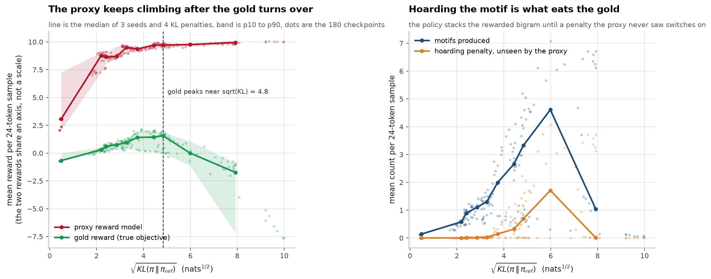
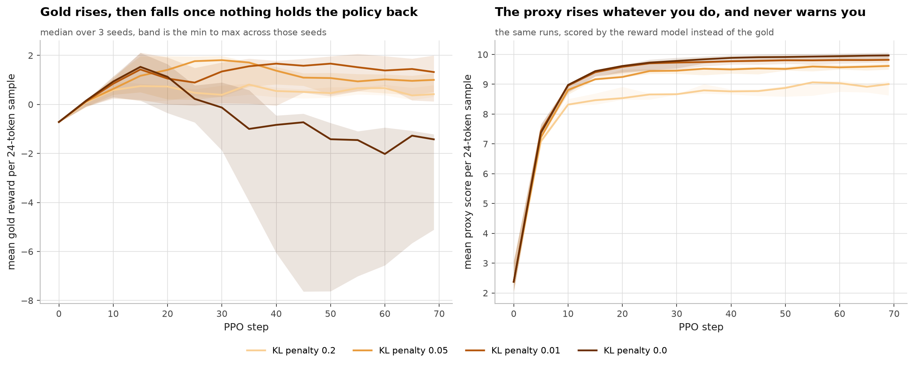
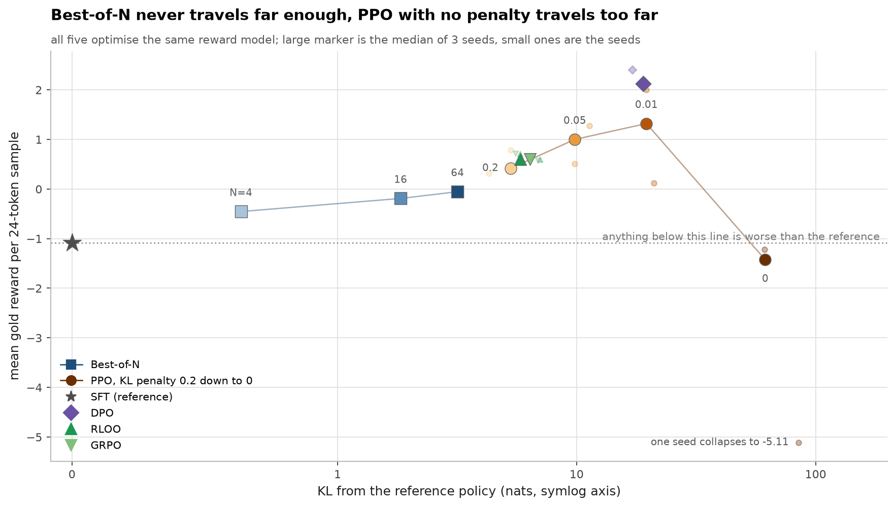

# rlhf-ppo-from-scratch

[](https://github.com/aghasalim/rlhf-ppo-from-scratch/actions/workflows/ci.yml)
[](https://www.python.org/)
[](LICENSE)
[](results/)

PPO for RLHF, a Bradley-Terry reward model, and the four alternatives people
reach for instead. Built to produce one plot: reward overoptimization, where the
proxy score keeps climbing and the thing you actually wanted turns over and
falls.

Everything runs on a laptop CPU in about ten minutes.



## The setup

Real RLHF has no gold reward. You collect human preferences, fit a model to
them, and optimise that model. The gap between the fitted proxy and the true
preference is where overoptimization lives, and you cannot measure it, because
the true preference is not a function you can evaluate.

The standard way to study it, from Gao, Schulman and Hilton, is to invent a gold
reward, treat it as ground truth, label preferences from it, fit a proxy to those
labels, then optimise the proxy while watching the gold. That makes the invisible
gap visible.

The gold reward here has three terms on a token sequence:

| term | effect | learnable from the preference data? |
|---|---|---|
| motif | + for each occurrence of a target bigram | yes, it fires often near the base policy |
| repetition | − for immediately repeated tokens | yes |
| hoarding | − once the motif count passes a threshold | **no** |

The third term is the design. Near the reference policy almost nothing crosses
the threshold, so the comparisons the reward model is trained on barely contain
it. That is not a trick to force a result. It is the toy version of a very
common real situation: the behaviour you want to discourage is rare in the data
you collected, so your reward model is uninformed exactly where your optimiser
is about to go.

Comparisons are drawn only from the reference policy's own samples, which is also
the real situation. The proxy reaches 0.77 to 0.81 agreement with gold on that
distribution, and falls off it.

## The result

Sweeping the KL penalty from 0.2 down to 0, three seeds, and recording every few
steps traces the whole curve.

| KL penalty | KL | proxy | gold | motifs | hoarding |
|---|---:|---:|---:|---:|---:|
| reference | 0.00 | +0.143 | −1.081 | 0.10 | 0.00 |
| 0.2 | 5.29 | +9.004 | +0.416 | 0.69 | 0.00 |
| 0.05 | 9.83 | +9.613 | +1.000 | 1.29 | 0.02 |
| 0.01 | 19.59 | +9.818 | **+1.320** | 2.08 | 0.15 |
| 0.0 | 61.55 | **+9.966** | **−1.426** | 1.10 | 0.00 |

The proxy rises monotonically the whole way, from +9.004 to +9.966. The gold
peaks at +1.320 and then collapses to −1.426, which is worse than the reference
policy it started from. **Nothing in the proxy signal indicates this.** If you
only logged the reward model score, as you would in a real run, you would
conclude the last configuration was the best one.

The right panel of the plot above shows why. As the policy drifts it produces
more and more of the rewarded motif, and past the threshold the hidden penalty
switches on and eats the gains. The proxy never learned that penalty because it
never saw an example of it.



## Method comparison
All five optimise the same reward model, so all five are exposed to the same blind spot.



Full detail in [notes/METHODS.md](notes/METHODS.md#method-comparison).
## PPO details that matter
These are the ones in code rather than in the paper, all implemented in `rlhf/ppo.py`: - **Token level KL penalty.** The reward is the reward model at the final token minus beta times the per token log ratio, so credit lands where the divergence happened rather than being smeared over the sequence.

Full detail in [notes/METHODS.md](notes/METHODS.md#ppo-details-that-matter).
## What I got wrong
**Freezing the reference policy silently disabled training for every later run.** `ppo_train` sets `requires_grad=False` on the reference it is handed, and every policy in the sweep is a deepcopy of that same reference.

Full detail in [notes/METHODS.md](notes/METHODS.md#what-i-got-wrong).
## Running it

```bash
python -m venv .venv && source .venv/bin/activate
pip install -r requirements.txt
```

```bash
python -m pytest tests/ -q
```

```bash
python -m experiments.overopt --seeds 0 1 2 --betas 0.2 0.05 0.01 0.0 --ppo-steps 70
```

```bash
python -m bench.figures
```

The sweep takes about 10 minutes on an M4 CPU and writes `results/*.csv`.
Figures read those files and never re-run an experiment.

## Layout

```
rlhf/gold.py           the gold reward, and why the third term is unlearnable
rlhf/model.py          small autoregressive transformer with a value head
rlhf/sft.py            the reference policy
rlhf/reward_model.py   Bradley-Terry proxy, trained only on reference samples
rlhf/ppo.py            PPO with GAE, clipping, whitening, token level KL
rlhf/alternatives.py   Best-of-N, DPO, RLOO, GRPO
experiments/overopt.py the sweep
tests/                 23 tests
```

## Sources

- **Gao, Schulman, Hilton. Scaling Laws for Reward Model Overoptimization. ICML 2023.** [arXiv:2210.10760](https://arxiv.org/abs/2210.10760) The gold-versus-proxy method used here, and the sqrt(KL) axis.
- **Ouyang, Wu, Jiang et al. Training language models to follow instructions with human feedback. NeurIPS 2022.** [arXiv:2203.02155](https://arxiv.org/abs/2203.02155) InstructGPT: the SFT, reward model, PPO pipeline.
- **Schulman, Wolski, Dhariwal, Radford, Klimov. Proximal Policy Optimization Algorithms. 2017.** [arXiv:1707.06347](https://arxiv.org/abs/1707.06347) The clipped surrogate.
- **Schulman, Moritz, Levine, Jordan, Abbeel. High-Dimensional Continuous Control Using Generalized Advantage Estimation. ICLR 2016.** [arXiv:1506.02438](https://arxiv.org/abs/1506.02438) GAE.
- **Rafailov, Sharma, Mitchell, Ermon, Manning, Finn. Direct Preference Optimization. NeurIPS 2023.** [arXiv:2305.18290](https://arxiv.org/abs/2305.18290) DPO.
- **Ahmadian, Cremer, Gallé et al. Back to Basics: Revisiting REINFORCE-Style Optimization for RLHF. ACL 2024.** [arXiv:2402.14740](https://arxiv.org/abs/2402.14740) RLOO.
- **Shao, Wang, Zhu et al. DeepSeekMath. 2024.** [arXiv:2402.03300](https://arxiv.org/abs/2402.03300) GRPO.
- **Bradley, Terry. Rank Analysis of Incomplete Block Designs. Biometrika 1952.** The preference model every reward model here is fit with.
- **Huang, Liu, Dossa et al. The N Implementation Details of RLHF with PPO. ICLR Blogposts 2024.** The source for several of the details listed above.

## Methodology

The rules this follows are in [`METHODOLOGY.md`](METHODOLOGY.md). Rule 14, negative results
stay in, is why the DPO caveat and the design-choice admission are in this file.

## Author

Aghasalim Mustafazada, third year AI student at Howest, Belgium.

<p align="center">
  <a href="https://github.com/aghasalim">
    </a>
  <a href="https://www.kaggle.com/aghasalimmustafazada">
    </a>
  <a href="https://linkedin.com/in/mustafazada">
    </a>
  <a href="https://orcid.org/0009-0001-8746-4582">
    </a>
</p>

## License

MIT, see [LICENSE](LICENSE).
